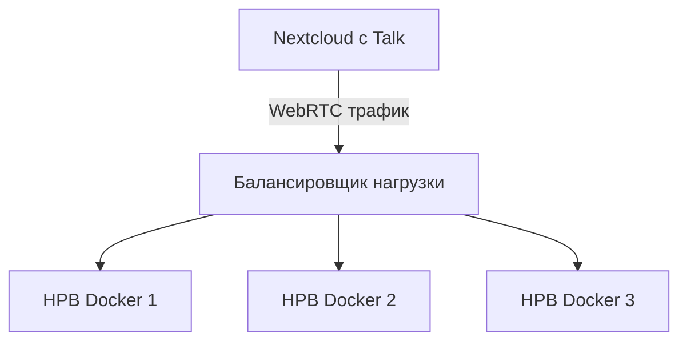

# nextcloud-notebook

```markdown
# Nextcloud Talk с HPB в Docker

## Архитектура решения

```


Эта диаграмма Mermaid показывает:
1. Nextcloud с модулем Talk как источник трафика
2. Балансировщик нагрузки (Nginx/Haproxy) как центральный распределитель
3. Несколько контейнеров HPB (High Performance Backend) для обработки медиатрафика

Стили добавлены для лучшей визуализации компонентов:
- Зеленый - Nextcloud
- Синий - Балансировщик
- Оранжевый - HPB инстансы

## Требования

- Установленный Nextcloud с модулем Talk
- Docker и Docker Compose
- Балансировщик нагрузки (Nginx/Haproxy)

## Настройка Nextcloud Talk

1. Включите модуль Talk в Nextcloud
2. Настройте STUN/TURN сервер (опционально)

## Установка High Performance Backend (HPB) в Docker

1. Создайте docker-compose.yml:

```yaml
version: '3'

services:
  hpb:
    image: nextcloud/hpb
    restart: always
    environment:
      - HPB_SECRET=your_secret_key
      - HPB_VERBOSE=1
    ports:
      - "8001:8001"
    volumes:
      - ./hpb_data:/tmp
```

2. Запустите контейнер:

```bash
docker-compose up -d
```

## Настройка балансировщика нагрузки (Nginx)

Пример конфигурации для балансировки между несколькими HPB:

```nginx
upstream hpb_backend {
    server hpb1:8001;
    server hpb2:8001;
    server hpb3:8001;
}

server {
    listen 8443 ssl;
    server_name your.domain.com;

    ssl_certificate /path/to/cert.pem;
    ssl_certificate_key /path/to/key.pem;

    location / {
        proxy_pass http://hpb_backend;
        proxy_http_version 1.1;
        proxy_set_header Upgrade $http_upgrade;
        proxy_set_header Connection "upgrade";
        proxy_set_header Host $host;
        proxy_set_header X-Real-IP $remote_addr;
        proxy_set_header X-Forwarded-For $proxy_add_x_forwarded_for;
        proxy_set_header X-Forwarded-Proto $scheme;
    }
}
```

## Конфигурация Nextcloud для работы с HPB

1. Добавьте в config.php:

```php
'hpb' => [
    'url' => 'https://your.loadbalancer:8443',
    'secret' => 'your_secret_key',
],
```

2. Настройте Talk:

```bash
occ talk:hpb add your.loadbalancer 8443 your_secret_key
```

## Масштабирование

Для увеличения производительности:
1. Добавьте больше инстансов HPB
2. Обновите upstream в балансировщике нагрузки
3. Убедитесь, что все инстансы используют одинаковый SECRET_KEY

## Мониторинг

Проверьте статус HPB:

```bash
occ talk:hpb list
occ talk:hpb test
```

## Примечания

- Для продакшн среды используйте SSL/TLS
- Настройте мониторинг и логирование
- Регулярно обновляйте контейнеры HPB

Более подробная информация:  
[Nextcloud HPB with Docker Documentation](https://github.com/nextcloud-snap/nextcloud-snap/wiki/How-to-configure-talk-HPB-with-Docker)
```
